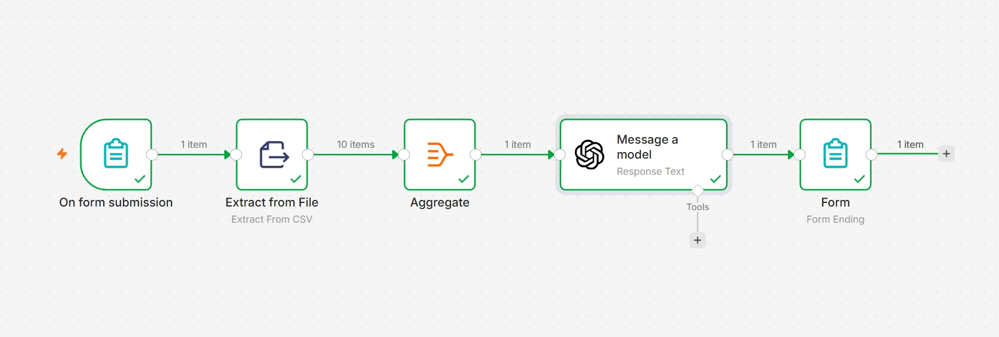

# 🤖 AI CSV Data Insights Generator

An AI-powered automation that reads any CSV 
file and instantly generates 5 business 
insights using OpenAI GPT-4 and n8n.

## 🛠️ Tools Used
- n8n (Workflow Automation)
- OpenAI GPT-4
- n8n Form Trigger
- Extract from File Node
- Aggregate Node

## ⚙️ How It Works
1. User uploads a CSV file via form
2. n8n extracts and aggregates all rows
3. Data is sent to OpenAI GPT-4
4. 5 actionable business insights are 
   displayed instantly

## 🚀 Features
- Upload any CSV file
- Get 5 AI generated insights instantly
- No coding needed by end user
- Works for sales, inventory, student 
  data and more

## 📸 Workflow

## 📹 Demo Video
[Click here to watch demo](AI-CSV-DATA-INSIGHTS-GENERATOR-DEMO.mp4)

## 👤 Author
Priyanshu — AI Automation Developer
